# Ransomware Detection Using Deep Learning

A deep learning-based cybersecurity application that uses **visual representations of executable files** and Convolutional Neural Networks (CNNs) to classify samples based on learned malware-related patterns.

The system converts executable byte data into grayscale images and uses a CNN-based model for classification through a Flask web application.

> **Note:** This project performs static analysis on byte-derived images. Executable files are not executed during the detection process.

---

## 🚀 Project Overview

Traditional malware detection techniques often rely on signatures or manually engineered features. Modified, packed, or obfuscated malware can make such approaches challenging.

This project explores an image-based deep-learning approach:

**Executable File → Raw Bytes → Byte Image → CNN → Classification**

Instead of executing an executable file, its binary contents can be represented as an image. The resulting image preserves structural patterns from different regions of the executable, allowing a CNN to learn visual representations of those patterns.

The project also provides a web interface for user authentication, sample upload, prediction, and result visualization.

---

## 📌 Problem Statement

Ransomware and other malware can be modified to make traditional signature-based detection more difficult.

The goal of this project is to investigate whether **deep learning on byte-level visual representations of executable files** can learn patterns that distinguish malicious software from benign software.

---

## 💡 Solution

The application combines binary-to-image transformation, CNN-based classification, and a web interface into one workflow.

**Executable Data → Byte Representation → Grayscale Image → CNN Model → Classification → Result**

The system treats executable content as data for static analysis rather than executing the executable itself.

---

## ✨ Key Features

### 🔐 User Authentication

* User registration
* User login
* Authentication-based application access
* Session-based user workflow

### 🧠 CNN-Based Classification

* Deep-learning-based classification
* Image-based malware analysis
* CNN feature learning
* Prediction on image representations of executable data

### 🖼️ Byte Image Analysis

* Executable bytes represented as image pixels
* Grayscale image processing
* Static analysis approach
* Visual representation of binary structures

### 📤 File Testing

* Upload a supported sample for analysis
* Process the sample through the prediction pipeline
* Display the model classification result

### 📊 Prediction Results

The application provides classification results such as:

* **Malware**
* **Benign**

The prediction represents the model's classification based on patterns learned from its training data.

### 🌐 Web Application

The project includes a Flask-based web interface for:

* Registration
* Login
* Dashboard
* File testing
* Prediction
* Result visualization

---

## 🧠 How It Works

The system follows these main steps:

1. Collect executable-file samples from the dataset.
2. Read executable data as raw bytes.
3. Convert byte values into pixel intensities.
4. Arrange the bytes into a 2-D image representation.
5. Preprocess the generated image.
6. Feed the image into the CNN model.
7. Train the model using the available dataset.
8. Evaluate the model on test samples.
9. Use the trained model to classify new samples within the learned dataset distribution.
10. Display the prediction through the web application.

### Pipeline

```text
Executable File
       ↓
   Raw Bytes
       ↓
Byte-to-Pixel Mapping
       ↓
 Grayscale Image
       ↓
Image Preprocessing
       ↓
      CNN
       ↓
Classification
       ↓
 Web Result
```

---

## 🖼️ What the EXE Image Represents

The generated image is **not a screenshot of the executable running**.

It is a visual representation of the executable's raw binary data.

Each byte has a value between **0 and 255**, which can be mapped to a grayscale pixel intensity.

```text
Byte value 0   → Black
Byte value 255 → White
```

The bytes are arranged sequentially into rows and columns to create the image.

Different parts of an executable can produce different visual patterns.

### Common Structures Represented in the Image

* **PE Header** — executable metadata and structural information
* **`.text` section** — program code
* **`.rsrc` section** — resources such as icons, strings, and embedded data
* **Packed/encrypted regions** — may appear as high-entropy or noisy areas
* **Repeated data and padding** — may produce recurring patterns
* **Strings and structured data** — may produce recognizable visual textures

The resulting image can therefore act as a visual representation of the executable's underlying byte structure.

---

## 🔍 Why CNNs Can Be Used

Convolutional Neural Networks are designed to identify spatial patterns such as:

* Edges
* Textures
* Shapes
* Local structures
* Repeated patterns

Executable byte images can contain spatial patterns created by the organization of binary data.

Different executable and malware samples may have differences in:

* Packing characteristics
* Section layouts
* Resource structures
* Entropy distributions
* Code/data patterns

A CNN can learn such patterns automatically instead of requiring every feature to be manually designed.

---

## 🛡️ Why Use EXE-Derived Images Instead of Normal Images?

The images used by this project are specifically derived from executable data.

A normal photograph or unrelated image does not represent the binary structure of an executable.

```text
EXE → Byte Image → Represents executable byte structure

Photo → Normal Image → Unrelated to executable structure
```

The important information is not simply that the input is an image.

The important information is that **the image encodes executable byte data**.

---

## 📊 Dataset

This project uses the **Malware as Images** dataset available on Kaggle.

**Dataset:** Matthew Fields — Malware as Images

[Malware as Images Dataset on Kaggle](https://www.kaggle.com/datasets/matthewfields/malware-as-images?utm_source=chatgpt.com)

The dataset contains visual representations of executable files generated from their binary contents.

> Dataset structure and class distribution may vary depending on the specific version or subset used for training.

---

## 🏗️ Model Approach

The project uses a **Convolutional Neural Network (CNN)** to learn patterns from malware image representations.

The general processing workflow is:

```text
Dataset
   ↓
Train / Validation / Test Data
   ↓
Image Preprocessing
   ↓
CNN
   ↓
Feature Extraction
   ↓
Classification Layer
   ↓
Prediction
```

The trained model is integrated into the Flask application for prediction.

---

## 🔬 Why This Approach?

### Advantages

* **Static analysis** — executable files do not need to be executed.
* **Automatic feature learning** — CNNs learn image patterns without extensive manual feature engineering.
* **Image-based representation** — binary data can be represented in a format suitable for computer-vision techniques.
* **Efficient inference** — once trained, the model can perform predictions through the application.
* **Transfer-learning compatibility** — computer-vision architectures can potentially be adapted to this type of classification.

---

## 🔄 Alternative Malware Detection Approaches

Image-based malware classification is one approach among several.

### 1. Static PE Analysis

Features can be extracted from executable files, including:

* PE header information
* Imported functions
* Section sizes
* Entropy
* Strings
* Metadata

These features can then be used with traditional machine-learning algorithms such as Random Forest or SVM.

**Advantage:** Features can be easier to interpret.

---

### 2. Dynamic Analysis

The executable is executed in a controlled environment such as a sandbox and its behavior is monitored.

Possible signals include:

* API calls
* File-system activity
* Network activity
* Process behavior
* Registry modifications

**Advantage:** Can reveal runtime behavior.

**Disadvantage:** Requires a carefully isolated execution environment and can be more resource-intensive.

---

### 3. Hybrid Analysis

A more comprehensive system can combine multiple sources of information:

```text
Static PE Features
        +
Byte-Image CNN
        +
Dynamic Behavior
        ↓
Combined Detection System
```

This can provide additional information but also increases system complexity.

---

## ⚠️ Model Limitations

The model's performance depends heavily on the dataset used for training.

A model trained on a particular dataset distribution may not generalize equally well to:

* Newly created malware families
* Previously unseen ransomware
* Heavily obfuscated samples
* Different packing techniques
* Executables from different distributions
* Samples significantly different from the training data

If the model performs poorly on an unseen sample, this can indicate a **distribution difference between the training data and the new sample**.

Improving generalization would require more diverse training data, appropriate validation strategies, and evaluation on representative unseen samples.

---

## 🧪 Important Security Consideration

This project is designed as a **static malware-analysis experiment**.

Executable contents are treated as data and represented as images rather than being executed during the image-based detection process.

If working with actual malware samples, they should only be handled in an appropriately isolated and controlled cybersecurity environment.

> **Do not execute unknown or malicious executables on a personal computer.**

---

## 📈 Evaluation

Model performance can be evaluated using:

* Accuracy
* Precision
* Recall
* F1-score
* Confusion Matrix

For malware detection, accuracy alone can be misleading when classes are imbalanced. Precision and recall should also be considered.

Actual measured results should be reported from the trained model rather than estimated values.

---

## 🛠️ Technology Stack

### Machine Learning

* Python
* TensorFlow / Keras
* PyTorch
* NumPy
* Pandas
* Scikit-learn
* CNN / Deep Learning

### Web Application

* Flask
* HTML
* CSS
* Jinja Templates

### Database

* MySQL

### Data & Visualization

* Image Processing
* Matplotlib
* Kaggle Dataset

### Development

* Jupyter Notebook
* Git
* GitHub

---

## 📂 Project Structure

```text
Ransomware_CNN/
│
├── samples/
│   ├── test.png
│   ├── test2.png
│   ├── test3.png
│   ├── test4.png
│   ├── test5.png
│   └── test6.png
│
├── screenshots/
│   ├── BenignFile-Testing.png
│   ├── BenignSample.png
│   ├── Dashboard1.png
│   ├── Dashboard2.png
│   ├── Dashboard3.png
│   ├── Dashboard4.png
│   ├── Login.png
│   ├── MalwareFile-Testing.png
│   ├── MalwareSample.png
│   ├── Prediction.png
│   └── Register.png
│
├── static/
│   └── style.css
│
├── templates/
│   ├── base.html
│   ├── index.html
│   ├── login.html
│   ├── nav.html
│   ├── predict.html
│   ├── register.html
│   └── result.html
│
├── app.py
├── ransomware.sql
├── ransomware_cnn.docx
├── requirements.txt
├── train.ipynb
├── README.md
└── .gitignore
```

---

## 📸 Screenshots

### 🔐 Login

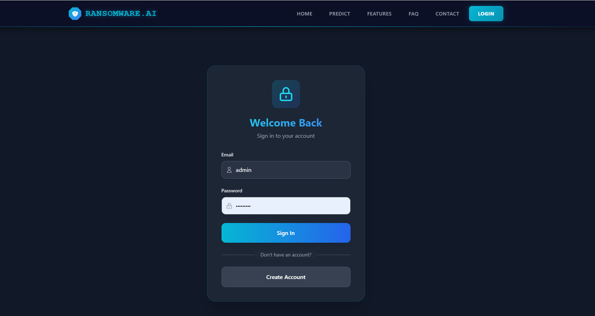

### 📝 Register

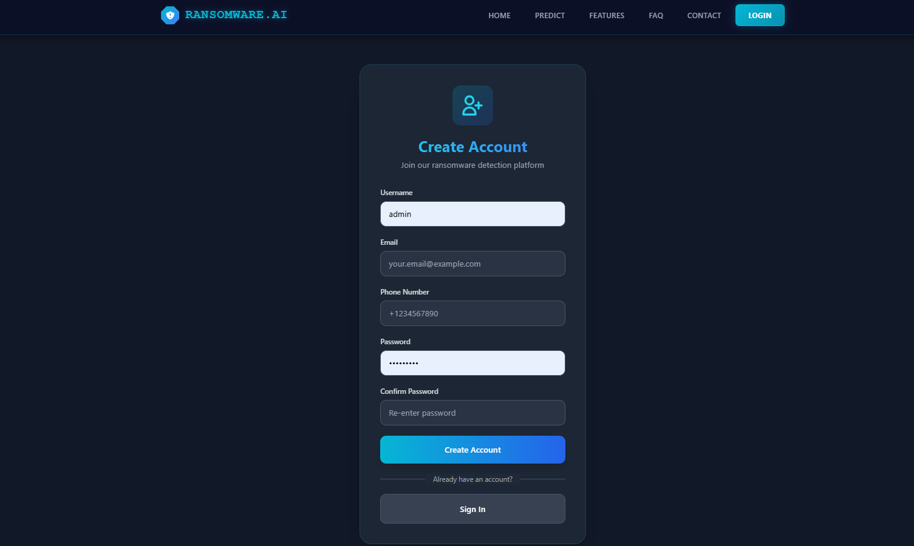

### 📊 Dashboard

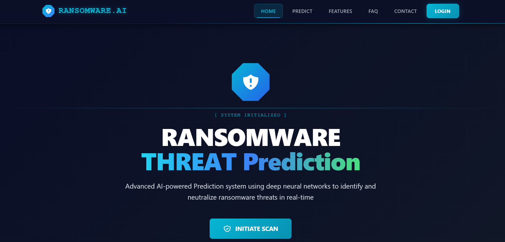

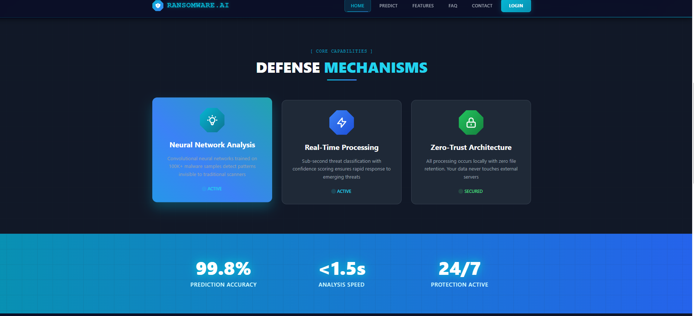

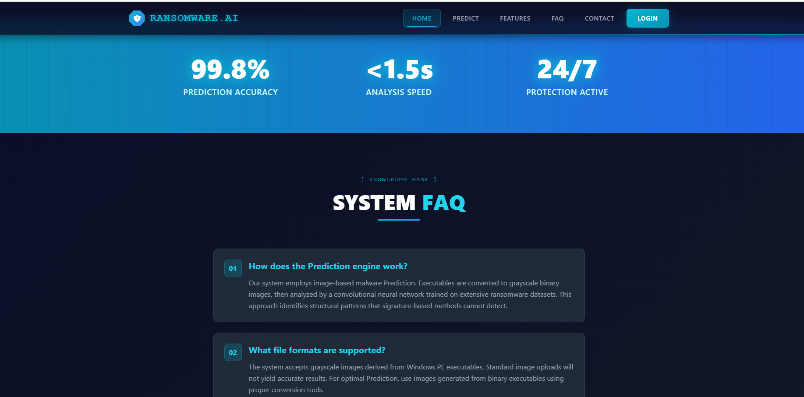

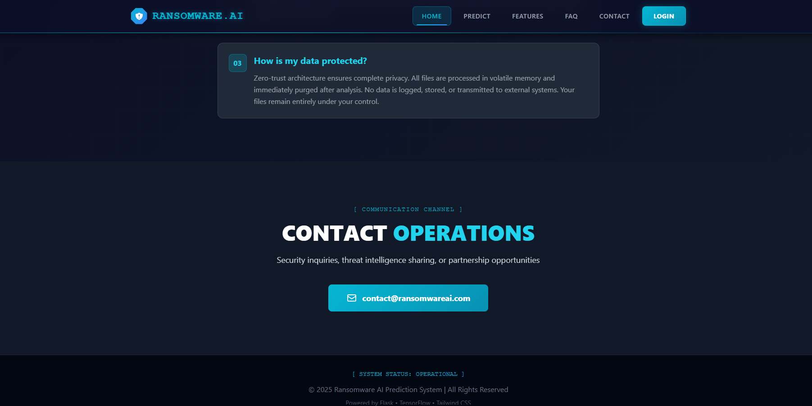

### 🧪 Prediction

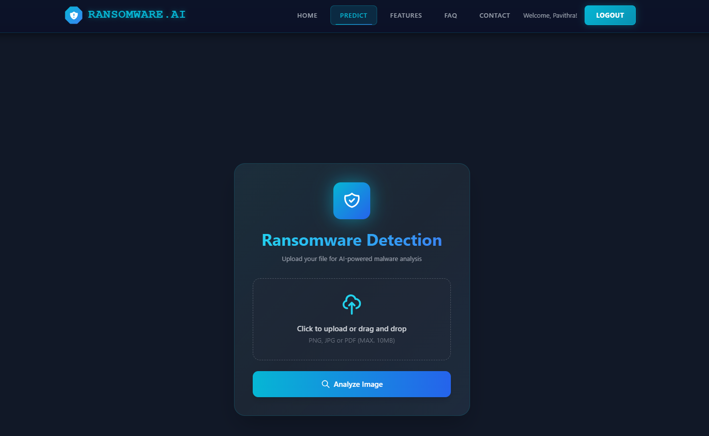

### 🦠 Malware Sample

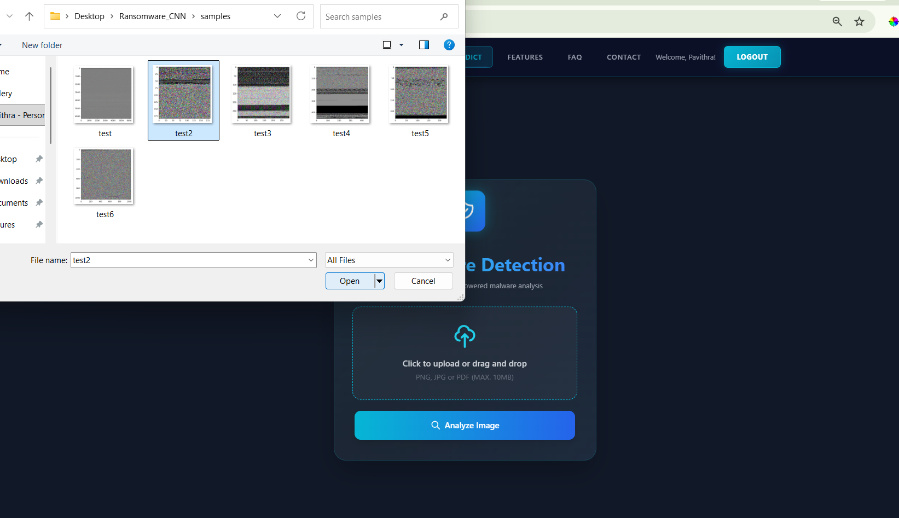

### 🔬 Malware File Testing

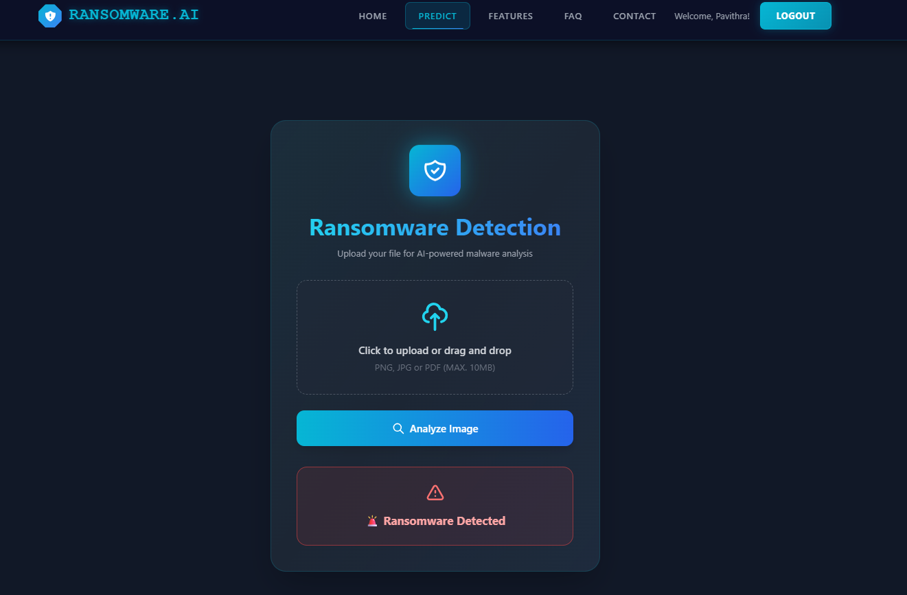

### 🟢 Benign Sample

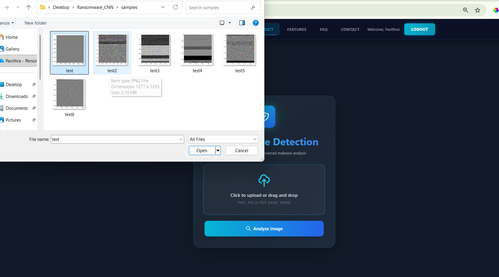

### 🔬 Benign File Testing

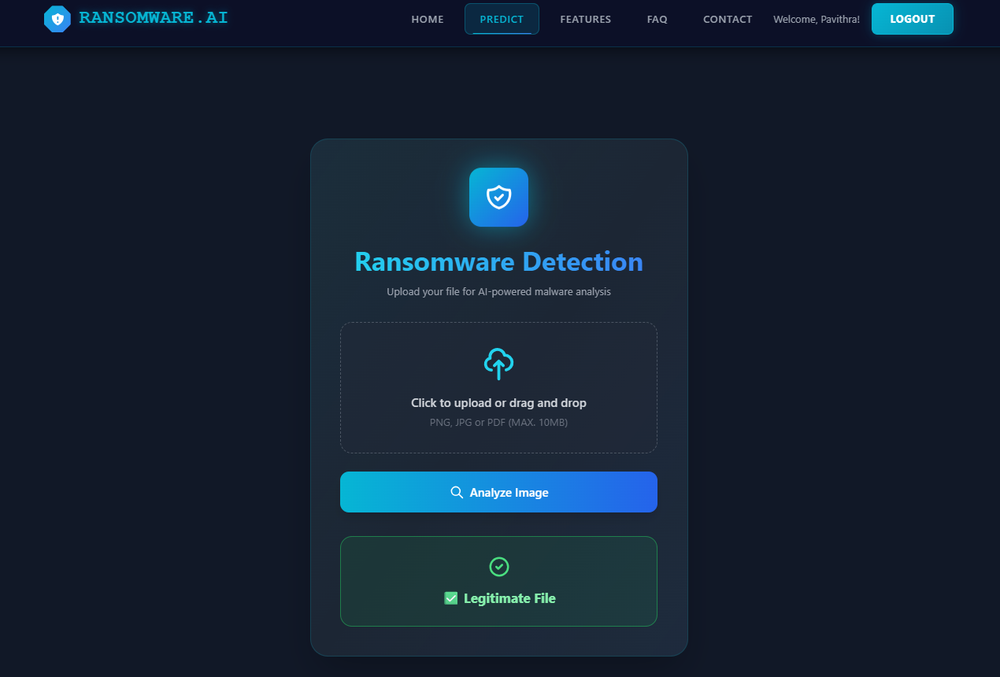

---

## 🚀 Future Improvements

Potential improvements include:

* Training on a larger and more diverse malware dataset
* Adding more ransomware families
* Testing against completely unseen samples
* Comparing multiple CNN architectures
* Using transfer-learning architectures
* Adding explainability techniques such as Grad-CAM
* Combining image-based features with PE metadata
* Evaluating robustness against packed and obfuscated executables
* Improving false-positive and false-negative monitoring
* Expanding the web application
* Adding additional cybersecurity analysis features

---

## 🎯 Key Learning Outcomes

Through this project, I explored:

* Binary-to-image transformation
* Static malware analysis
* Convolutional Neural Networks
* Image preprocessing
* Deep-learning classification
* Model evaluation
* Malware visualization
* Dataset limitations and generalization
* Flask web application development
* MySQL database integration
* User authentication
* Cybersecurity considerations when handling executable files

---

## 📚 Dataset Reference

**Malware as Images — Matthew Fields**

[View Dataset on Kaggle](https://www.kaggle.com/datasets/matthewfields/malware-as-images?utm_source=chatgpt.com)

Please refer to the original dataset page for dataset licensing, attribution, structure, and usage information.

---

## ⚠️ Disclaimer

This project is intended for **educational, research, and cybersecurity learning purposes**.

The model should not be treated as a complete antivirus solution or as a guarantee that an executable is safe or malicious.

Machine-learning predictions are dependent on the training data, preprocessing pipeline, model architecture, and evaluation methodology.

---

## 👩‍💻 Developer

**P N Pavithra**

AI & Data Science Graduate

A cybersecurity and machine-learning project exploring deep-learning approaches to malware detection through executable byte-image representations and CNN-based classification.
